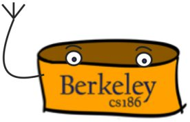

# RookieDB

This repo contains a bare-bones database implementation, which supports
executing simple transactions in series. In the assignments of
this class, you will be adding support for
B+ tree indices, efficient join algorithms, query optimization, multigranularity
locking to support concurrent execution of transactions, and database recovery.

